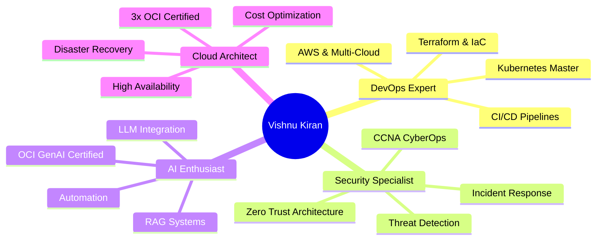

<div align="center">

```ascii
╔═══════════════════════════════════════════════════════════════════════════╗
║                                                                           ║
║   ██╗   ██╗██╗███████╗██╗  ██╗███╗   ██╗██╗   ██╗                       ║
║   ██║   ██║██║██╔════╝██║  ██║████╗  ██║██║   ██║                       ║
║   ██║   ██║██║███████╗███████║██╔██╗ ██║██║   ██║                       ║
║   ╚██╗ ██╔╝██║╚════██║██╔══██║██║╚██╗██║██║   ██║                       ║
║    ╚████╔╝ ██║███████║██║  ██║██║ ╚████║╚██████╔╝                       ║
║     ╚═══╝  ╚═╝╚══════╝╚═╝  ╚═╝╚═╝  ╚═══╝ ╚═════╝                        ║
║                                                                           ║
║            🚀 DevOps Engineer | ☁️ Cloud Architect | 🔐 Cyber Ops        ║
║                                                                           ║
╚═══════════════════════════════════════════════════════════════════════════╝
```


[](https://linkedin.com/in/vishnukirandabbara)
[](https://kiranlucky3.github.io)
[](mailto:your.email@example.com)

</div>

---

## 🎯 About Me

```python
class VishnuKiran:
    def __init__(self):
        self.role = "DevOps Engineer | Cloud Security Specialist"
        self.location = "Gothenburg, Sweden 🇸🇪"
        self.education = "M.Sc. Cybersecurity @ University West"
        self.former = "DevOps Engineer @ 4 Square Technology"
        self.currently_seeking = [
            "DevOps Engineering Roles",
            "Cloud Security Positions", 
            "Site Reliability Engineering",
            "Platform Engineering Opportunities"
        ]
        
    def skills(self):
        return {
            "cloud": ["AWS", "Azure", "OCI", "Multi-Cloud Architecture"],
            "containers": ["Docker", "Kubernetes", "Container Security"],
            "iac": ["Terraform", "CloudFormation", "Ansible"],
            "cicd": ["Jenkins", "GitHub Actions", "GitLab CI", "ArgoCD"],
            "monitoring": ["Prometheus", "Grafana", "ELK Stack", "CloudWatch"],
            "security": ["Threat Detection", "Incident Response", "SIEM", "Zero Trust"],
            "scripting": ["Python", "Bash", "PowerShell"],
            "databases": ["MySQL", "PostgreSQL", "MongoDB"]
        }
    
    def certifications(self):
        return [
            "🏅 Oracle Cloud Infrastructure 2025 DevOps Professional",
            "🏅 OCI 2025 Generative AI Professional", 
            "🏅 OCI 2025 Architect Associate",
            "🏅 Cisco Certified Network Associate - CyberOps (CCNA)",
            "🎓 Master's in Cybersecurity (In Progress)"
        ]
    
    def current_focus(self):
        return "Building secure, scalable cloud infrastructure with AI-powered automation"

vishnu = VishnuKiran()
print(vishnu.current_focus())
# Output: Building secure, scalable cloud infrastructure with AI-powered automation
```

---

## 🛠️ Tech Arsenal

<div align="center">

### ☁️ Cloud Platforms


### 🐳 DevOps & Containers


### 💻 Languages & Scripting


### 🔐 Security & Monitoring


### 🗄️ Databases


### 🧠 AI & Automation


</div>

---

## 🎖️ Certifications & Credentials

<div align="center">

| Certification | Issuer | Year | Credential |
|--------------|--------|------|------------|
| 🥇 **Oracle Cloud DevOps Professional** | Oracle | 2025 | [View](https://catalog-education.oracle.com/ords/certview/sharebadge?id=548F8020C7DB62523EB34D00DEEF352004948470C53798D3406EBC12A68B2504) |
| 🤖 **OCI Generative AI Professional** | Oracle | 2025 | [View](https://catalog-education.oracle.com/ords/certview/sharebadge?id=7F495E8FDBD5740B3616AD78F973C8C63A5124CFED42E1B8E3B15694CC937049) |
| 🏛️ **OCI Architect Associate** | Oracle | 2025 | [View](https://catalog-education.oracle.com/ords/certview/sharebadge?id=5A515A184EFF5BBA786DAD77BB13347018EF474F8ADD745FBCBE90AB6BB0B01D) |
| 🔒 **CCNA CyberOps Associate** | Cisco | 2025 | [View](https://www.credly.com/badges/679aed3f-6da4-4f75-917b-19c165e624b6) |
| 🐧 **Linux Foundation Certified** | Simplilearn | 2022 | Verified |

</div>

---

## 📊 GitHub Analytics

<div align="center">
  


</div>

<div align="center">
  
[](https://git.io/streak-stats)

</div>

<div align="center">


</div>

---

## 🚀 Featured Projects

<div align="center">

<a href="https://github.com/kiranlucky3/project-1">
  
</a>

<a href="https://github.com/kiranlucky3/project-2">
  
</a>

<a href="https://github.com/kiranlucky3/project-3">
  
</a>

<a href="https://github.com/kiranlucky3/project-4">
  
</a>

</div>

---

## 💼 Professional Experience

```yaml
current_role:
  title: "Master's Student - Cybersecurity"
  institution: "University West, Sweden"
  period: "Sep 2025 - Jun 2026"
  focus:
    - Cyber-Physical Systems Security
    - Ethical Hacking & Penetration Testing
    - Cloud Security Architecture
    - AI-Powered Threat Detection

previous_role:
  title: "DevOps Engineer"
  company: "4 Square Technology"
  period: "Sep 2023 - Jul 2025"
  achievements:
    - "Architected and deployed scalable AWS infrastructure serving 100K+ users"
    - "Built CI/CD pipelines reducing deployment time by 75%"
    - "Implemented Infrastructure as Code with Terraform and Ansible"
    - "Orchestrated Kubernetes clusters with 99.9% uptime"
    - "Automated cloud security compliance checks using Python"
    - "Reduced cloud costs by 40% through resource optimization"

key_projects:
  - name: "Azure IoT Security Lab"
    tech: ["Azure", "Ubuntu VMs", "ThingsBoard", "Network Segmentation"]
    description: "Multi-tier IoT platform with secure telemetry pipeline"
  
  - name: "Active Directory Hardening"
    tech: ["AD", "Zero Trust", "IAM", "Privilege Escalation Defense"]
    description: "Enterprise AD security implementation with Zero Trust principles"
```

---

## 🎓 Education Journey

<table align="center">
<tr>
<td align="center" width="50%">

### 🎓 Master's Degree
**Cybersecurity**  
University West, Sweden  
*2025 - 2026*

**Focus Areas:**
- Ethical Hacking
- Cyber-Physical Systems
- Network Security
- Cloud Security

</td>
<td align="center" width="50%">

### 🎓 Bachelor's Degree
**Computer Science**  
Blekinge Institute of Technology  
*2022 - 2023*

**Focus Areas:**
- Cloud Computing
- Mobile Development
- Software Engineering
- System Design

</td>
</tr>
</table>

---

## 🌟 What Makes Me Unique

<div align="center">



</div>

---

## 📈 Contribution Graph

<div align="center">


</div>

---

## 🎯 2026 Goals

- [ ] 🏆 Contribute to 5+ major open-source DevOps projects
- [ ] 📚 Complete AWS Solutions Architect Professional
- [ ] 🚀 Build and deploy 3 AI-powered DevOps tools
- [ ] 🎤 Speak at a cloud/security conference
- [ ] 💼 Join a FAANG company as a DevOps/SRE Engineer
- [ ] 📝 Write technical blog series on Cloud Security
- [ ] 🤝 Mentor 10+ aspiring DevOps engineers

---

## 📊 Weekly Development Breakdown

<!--START_SECTION:waka-->
```text
Python           12 hrs 45 mins  ████████████░░░░░░░░░  52.3%
YAML             4 hrs 30 mins   ████░░░░░░░░░░░░░░░░░  18.5%
Terraform        3 hrs 15 mins   ███░░░░░░░░░░░░░░░░░░  13.4%
Bash             2 hrs 20 mins   ██░░░░░░░░░░░░░░░░░░░   9.6%
Markdown         1 hr 30 mins    █░░░░░░░░░░░░░░░░░░░░   6.2%
```
<!--END_SECTION:waka-->

---

## 🌐 Connect With Me

<div align="center">

[](https://linkedin.com/in/vishnukirandabbara)
[](https://github.com/kiranlucky3)
[](mailto:your.email@example.com)
[](https://kiranlucky3.github.io)
[](https://twitter.com/yourhandle)

</div>

---

## 💡 Philosophy

<div align="center">

> *"The best way to predict the future is to automate it."*

> *"Security is not a product, but a process embedded in culture."*

> *"Cloud native isn't just technology—it's a mindset."*

</div>

---

## 🏆 GitHub Trophies

<div align="center">


</div>

---

## 📫 Let's Build Something Amazing Together!

<div align="center">

**Open to:**
- DevOps Engineering positions
- Cloud Security roles
- Site Reliability Engineering
- Platform Engineering
- Cybersecurity opportunities

**Interested in collaborating on:**
- Open source DevOps tools
- Cloud security projects
- AI-powered automation
- Kubernetes operators
- Infrastructure as Code libraries


</div>

---

<div align="center">

### ⚡ Fun Fact
```python
while (coffee == True):
    code()
    deploy()
    monitor()
    secure()
    repeat()
```

**💬 Ask me about:** DevOps, Cloud Architecture, Kubernetes, Security Automation, Python, or anything tech!

**🌱 Currently exploring:** AI/ML Operations (MLOps), Service Mesh, eBPF, and Chaos Engineering

**⚡ Superpower:** Turning complex infrastructure into elegant, automated solutions

</div>

---

<div align="center">
  
**[⬆ Back to Top](#)**

Made with 💙 and ☕ by Vishnu Kiran Dabbara

*"Deploying dreams, one commit at a time"* 🚀

</div>
